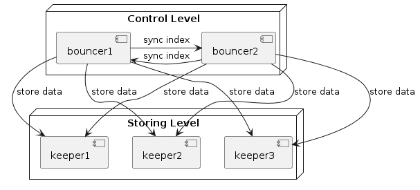

## Description

The storing service is pepresented with two components - `bouncer` and `keeper`. Both have the same [API](#api)

### Keeper

`Keeper` is simple hash map service with `REST API` for `set`, `get` and `delete` operations. It stores key:value pairs in `RAM` memory, and protects pairs with `mutex`, so no worry about consistency.
Each pair could be set with `ttl` or will be used default `ttl` for the whole service. After ttl expiration entry will be automaticly removed.

### Bouncer

`Bouncer` is `load balancer` for keepers. It knows about keepers which he controls, and looking after their status via `health check`. When request to store key:value pair comes to `bouncer` it decides which `keeper` will stores this pair. It decides where to store pair by algorythms: 

- hash func from storing key
- round robin  `// todo`

If detected storage unavailable, `bouncer` will try to put pair in first alive storage. The same behaivor with updating: try to put in storage with actual key, try to put in storage detected with algorythm, try to put in first alive 

`Bouncer` stores index with pairs key:storage_index, so it knows where from to take storing value or update. 


## Deployment
### Standalone Mode

If you need just one instance of storage it enough to deploy only one `keeper`.

Available environment variables:
- `HTTP_ADDRESS` address for `keeper` deployment, default `localhost:8181`
- `TTL` ttl for entries, uses when doesnt pass in request, default `10m`
- `DEBUG` debug mod, default `false`


To run `keeper` use

```sh
go run . cmd/keeper/main.go
```

Or build it first
```sh
go build -o keeper  cmd/keeper/main.go

./keeper
```

After it is avalaible for [usage](#api).


## Sharded Mode

If you need more scalable solution it possible to up a multiple keepers and interact with them by `bouncer`.

At first deploy mutliple inctances of `keeper` like [describes here](#standalone-mode). Let's say it will be 3 instances on `localhost` on `8181`, `8182` and `8183` ports.

After that it possible to configure and up `bouncer` via config file

```yaml
#config.yaml
bouncer:
  addr: localhost:8080
  debugMode: true
  storages:
  - shard1:
    addr: http://localhost:8181
    healthCheckInterval: 5s

  - shard2:
    addr: http://localhost:8182
    healthCheckInterval: 5s

  - shard3:
    addr: http://localhost:8183
    healthCheckInterval: 10s
```

Now it possible to run `bouncer`

```sh
CONFIG_PATH=config.yaml go run cmd/bouncer/main.go
```

Or build it first
```sh
go build -o bouncer  cmd/bouncer/main.go

CONFIG_PATH=config.yaml ./keeper
```

You shoud see the output similar with this
```sh
2024/05/11 15:09:11 DEBUG debug level is on
2024/05/11 15:09:11 INFO health check status "http://localhost:8181/" is alive: true
2024/05/11 15:09:11 INFO health check status "http://localhost:8182/" is alive: true
2024/05/11 15:09:11 INFO health check status "http://localhost:8183/" is alive: true
2024/05/11 15:09:11 INFO start bouncer on "localhost:8080"
```

Cluster is ready. [Usage API](#api) 

## Sharded Mode With Failover (Not Implemented Yet)

Future impovment could include `failover` mode for `bouncer`. It will let to deploy two `bouncers`.
It will make cluster more fault tolerance. Both `bouncers` will sync their indexes and keep them consistence.



## API
`Key` and `ttl`(1s, 10m, 500ms...) are passed like query parameters.

`Value` of entry is passed in request's body like plain text.

Examples
```sh
# set value

curl -X POST 'http://localhost:8181/set?key=key1&ttl=1m' -d 'storing_value' 

# get value
curl 'http://localhost:8181/get?key=key1'

# delete value 
curl -X DELETE 'http://localhost:8181/delete?key=key1'
```

# TODO
 - tests for bouncer
 - round robbin selection
 - failover bouncers
 - integration tests